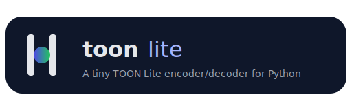

---

# 📦 **toonlite — Simple TOON Lite Encoder/Decoder for Python**
<p align="center">
  
</p>

[](https://pypi.org/project/toonlite/)
[](https://pypi.org/project/toonlite/)
[](https://github.com/manojrammurthy/toonlite-py/actions/workflows/ci.yml)
[](LICENSE)


`toonlite` is a lightweight, dependency-free Python library for encoding and decoding **TOON Lite**, a simple, human-friendly structured text format similar to JSON/YAML — but much easier to read and write.

It is the Python counterpart to your TOON Lite PHP library.

---

## ✨ **Features**

* 🚀 Simple API: `loads()` and `dumps()`
* 📄 Clean, indentation-based structure (like YAML but simpler)
* 🧱 Supports:

  * Key–value pairs (`key: value`)
  * Nested objects via indentation
  * Lists using `key: []` + `- item`
  * Scalars: integers, floats, booleans, null, and strings
* 🔧 Zero dependencies
* 🧪 Fully tested
* 📦 Packaged and ready for PyPI

---

## 📦 **Installation**

Once published on PyPI:

```bash
pip install toonlite
```

If installing from TestPyPI:

```bash
pip install --index-url https://test.pypi.org/simple/ --extra-index-url https://pypi.org/simple toonlite
```

---

## 🔧 **Usage Example**

```python
from toonlite import loads, dumps

text = """
name: Manoj
age: 26
address:
    city: Bengaluru
    zip: 560001
skills: []
    - Python
    - PHP
active: true
"""

# Decode TOON Lite → Python dict
data = loads(text)

print(data)
# {
#   'name': 'Manoj',
#   'age': 26,
#   'address': {'city': 'Bengaluru', 'zip': 560001},
#   'skills': ['Python', 'PHP'],
#   'active': True
# }

# Encode Python dict → TOON Lite
encoded = dumps(data)

print(encoded)
"""
name: Manoj
age: 26
address:
    city: Bengaluru
    zip: 560001
skills: []
    - Python
    - PHP
active: true
"""
```

---

## 🧪 **Running Tests**

Install dependencies:

```bash
pip install -e .
pip install pytest
```

Run the test suite:

```bash
pytest
```

---

## 📁 **Project Structure**

```
toonlite/
 ├─ src/toonlite/
 │   ├─ __init__.py
 │   ├─ encoder.py
 │   ├─ decoder.py
 │   └─ exceptions.py
 ├─ tests/
 │   └─ test_basic.py
 ├─ pyproject.toml
 ├─ README.md
 ├─ LICENSE
 └─ .gitignore
```

---

## 🧩 **TOON Lite Format (Supported Subset)**

### **1. Key–Value Pairs**

```
name: Alice
age: 30
```

### **2. Nested Objects (Indentation)**

```
address:
    city: Bengaluru
    zip: 560001
```

### **3. Lists**

```
skills: []
    - Python
    - ML
```

### **4. Scalars**

* `true`, `false`
* `null`
* `123`, `3.14`
* `"strings"` (no quotes necessary unless needed)

---

## 🛠️ **Development**

Editable install:

```bash
pip install -e .
```

Rebuild wheel + sdist:

```bash
python -m build
```

---

## 📄 **License**

This project is licensed under the **MIT License**.
See the `LICENSE` file for details.

---

## 🤝 Contributing

Contributions are welcome!
Open an issue or submit a pull request on GitHub.

---


